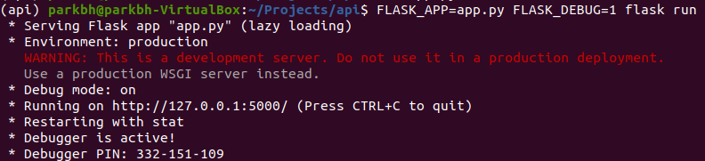
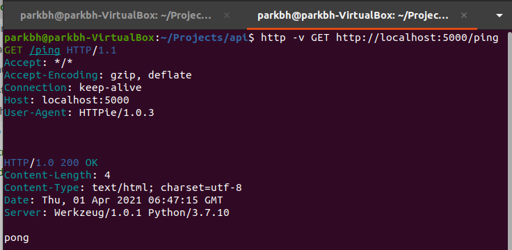

# [Chapter03] 첫 API 개발 시작

##### ※ Flask란?
- 파이썬으로 웹 애플리케이션을 구현할 때 사용되는 프레임워크로, 아주 가볍다는 특징을 갖고 있다. Django보다 가볍고, 비교적 쉽게 배울 수 있다는 장점을 갖고 있다. 

> ___프레임워크란?___
> 프레임워크는 특정 시스템을 구현하기 위해 공통적으로 요구되는 기능들과 구조를 재사용이 가능하도록 구햔한 것이다. 
> <br>__웹 프레임워크로 예를 들어보자.__ 
>  모든 웹 시스템은 소켓(socket)을 통해서 네트워크와 연결하여 외부 시스템으로부터 통신을 주고 받을 수 있어야 한다. 모든 웹 시스템은 이러한 기능을 필수로 구현해야 한다. 이러한 기능은 이미 규격화되어 시스템마다 각각 따로 구현해야 할 필요가 없다. 이미 구현되어 있는 코드를 재사용해도 된다. 그러므로 Flask 같은 웹 프레임워크를 사용함으로써 개발자는 웹 시스템을 통해 제공하고자 하는 비즈니스 로직(business logic)에만 집중할 수 있다. 

__프레임워크 vs 라이브러리의 차이__
- __공통점__ 은 둘다 필요한 기능을 재사용이 가능하도록 구현해 놓아서 다른 개발자들이 필요에 의해 사용할 수 있도록 해 놓았다는 점이다. 
- 라이브러리는 개발자가 자신의 코드 안에서 실행
- 프레임워크는 프레임워크가 개발자의 코드를 실행하는 개념
__`즉, 라이브러리는 개발자의 코드 안에 일부분으로 포함 되어 개발자가 원하는 대로 사용이 가능하지만, 프레임워크는 프레임워크가 제공하는 틀 안에서 개발자가 필요한 로직을 구현하는 차이가 있다.`__

__&#10004; STEP 01 : 가상환경 생성 및 활성화__ <br>
```
$ conda create --name api python = 3.7
$ source activate api
```

__&#10004; STEP 02 : Flask 모듈 설치__<br>
```
PS > pip install Flask
```

__&#10004; STEP 03 : ping 엔드포인트 구현하기__ <br>
첫 API 개발은 ping 엔드포인트(endpoint)를 구현하는 것부터 시작한다. 엔드포인트란 단순하게 설명하자면 API 서버가 제공하는 통신 채널 혹은 접점이라고 할 수 있다. 프론트엔드 서버 등의 클라이언트가 백엔드 API 서버와 통신할 때 엔드포인트에 접속하는 형태로 통신하게 된다. 각 엔드포인트는 고유의 URL 주소를 가지게 되며, 고유의 URL 주소를 통해 해당 엔드포인트에 접속할 수 있다.

일반적으로  각 엔드포인트는 고유의 기능을 담담하고 있다. 그리고 이러한 엔드포인트들이 모여서 하나의 API를 구성하는 것이다. 
ex) SNS 서비스를 위한 API는 사용자 sign up 엔드포인트, 사용자 로그인 엔드포인트, 새로운 포스팅 생성 엔드포인트, 다른 사용자와 친구 맺기 엔드포인트 등의 여러 엔드포인트들로 구성되어있다. <br>
`but, 최근에 나온 기술인 GraphQL(Graph Query Language)은 여러 엔드포인트로 구성되어 있지 않고 단 하나의 엔드포인트로 모든 기능을 제공하는 형태로 구성된다. `

ping 엔드포인트는 주로 API 서버가 현재 운행되고 있는지 아니면 정지된 상태인지를 간단하게 확인할 때 사용된다. 이러한 기능을 하는 엔드포인트를 __헬스 체크(health check)엔드포인트__ 라고도 한다. API 서버에 접속하지 않고 해당 API의 정상 운행 여부를 간단하게 체크하는 엔드포인트이다. <br>

먼저, 앞으로 우리가 만들어 갈 API 코드가 위치할 디렉터리를 생성하자. 디렉터리의 이름은 이 책에서는 "api"라고 지을 것이다. 하지만 실제 디렉터리의 이름은 다른 이름으로 지어도 상관은 없다. 터미널의 커맨드라인에서 다음의 명령어를 실행하여 디렉터리를 생성하자. 그리고 api.py 생성
```
$ mkdir -p ~/python-backend/api
api/ $ vim app.py
```
app.py는 아래와 같이 작성
```python
from flask import Flask

app = Flask(__name__)

@app.route("/ping", methods=['GET])
def ping():
    return "pong"

```
"app.py" 파일의 코드에서 특히 집중해야 하는 부분은 바로 어떻게 엔드포인트를 지정하는가다. Flask에서는 일반적으로 route 데코레이터를 사용해서 함수들을 엔드포인트로 등록하는 방식이 사용된다. 즉, Flask에서 엔드포인트를 구현한다는 것은 결국 일반 함수를 구현한다는 것과 큰 차이가 없다는 뜻이다. 이러한 관점에서 바라보면 결국 백엔드 API 개발도 구조적으로 크게 어렵거나 복잡할 것이 없다. 해당 API가 제공하는 서비스, 즉 비즈니스 로직(business logic)을 구현하는 함수들을 개발하는 것이 백엔드 API에서 차지하는 가장 큰 부분이 되는 것이다. 다시 한번 강조하고자 한다. API 코드의 전체적인 구조가 일단 잡히면 그 다음부터는 엔드포인트들, 즉 함수들을 구현하는 것이 개발의 대부분이다.<br>

__&#10004; STEP 04 :__ API 실행하기 <br>
이제 앞서 구현한 API 코드를 실행시켜 보도록 하자. Flask 애플리케이션을 실행하려면 다음과 같은 명령어를 터미널에서 입력하면 된다. 앞서 만들었던 ~python-backend/api 디렉터리로 변경 후 다음 명령어를 실행

```
$ FLASK_APP=app.py FLASK_DEBUG=1 flask run
```

출력된 화면을 보면 방금 실행시킨 API, 즉 app.py가 http://127.0.0.1:5000에서 돌아가고 있다는 뜻이다. 참고로 "127.0.0.1"은 로컬호스트의 IP이다. 

__&#10004; STEP 05 :__ httpie설치 <br>

ping 엔드포인트가 제대로 돌아가는지 실제로 API에 접속해서 테스트해보자. <br>

ping 엔드포인트에 접속하기 위해서는 ping 엔드포인트에 HTTP 요청(request)을 보내면 된다. HTTP 요청을 보내는 방법에는 여러가지가 있지만, 이 책에서는 터미널 명령어 환경에서 HTTP 요청을 보낼 수 있게 해주는 httpie라는 툴을 주로 사용할 것이다. 
```
$ sudo apt install httpie
```
httpi 설치 후 http라는 명령어를 터미널에서 사용하여 HTTP 요청을 보낼 수 있다. API가 실행되고 있는 상태에서 터미널 창을 새로 추가로 하나 열어 새로 tab을 생성한 후 아래 명령어 실행
```
$ http -v GET http://localhost:5000/ping
```

이미 실행되고 있는 API 에 HTTP 요청을 보내면, "pong" 텍스트로 응답받는것을 확인 가능. 

