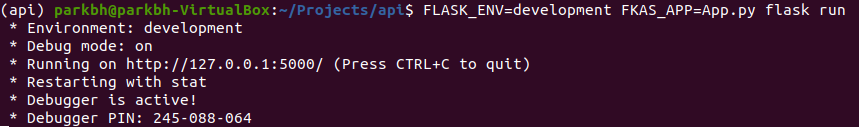
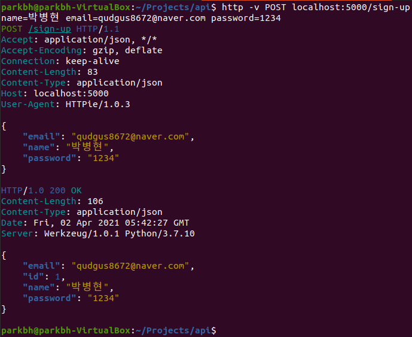
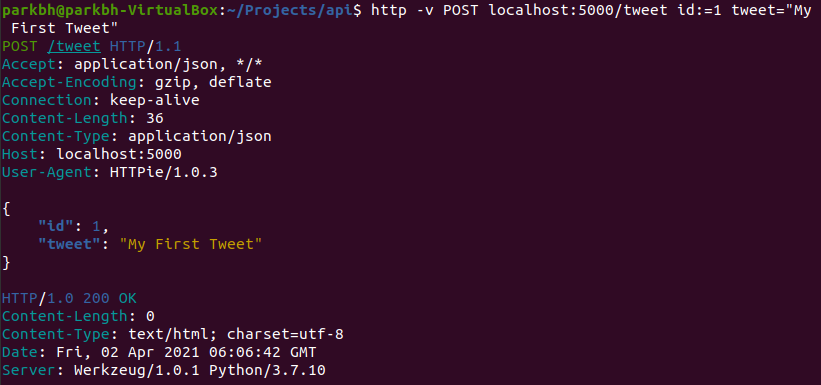
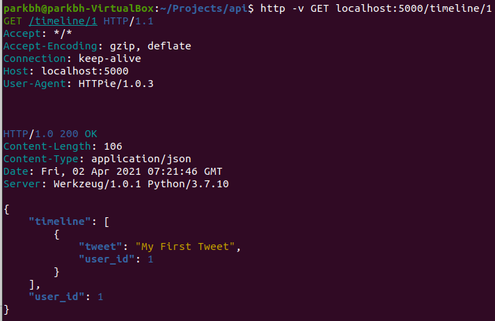

# [Chapter05] 본격적으로 API 개발하기
앞서 구현한 api 시스템은 "ping"엔드포인트 하나밖에 없는 API이다. 아직은 특별히 유용하지 않는 시스템으로 , 이제 본격적으로 API를 개발해 보도록 하자. <br>

우리가 구현할 API 시스템은 "미니터(Miniter)"다. "미니터"는 "미니 트위터(Mini Twitter)"를 줄인 말이다. 우리가 구현할 API 시스템은 미니 버전(mini version)트위터다. 즉 축소된 규모의 트위터 시스템을 만들어 볼 것이다. "미니터"를 구현하면서 API 개발의 핵심 구조와 개념들을 배우는 것이 목적이다. 
##### &#10004; STEP01 : 미니터의 기능
핵심 기능들
- 회원가입
- 로그인
- 트윗(tweet)
- 다른 회원 팔로우(follow)하기
- 다른 회원 언팔로우(unfollow)하기
- 타임라인(해당 사용자 그리고 사용자가 팔로우 하는 사용자들의 트윗들)

물론 실제 트위터의 API시스템은 이보다 훨씬 많은 기능을 제공하고 있다. 그러나 트위터는 많은 개발자와 트위터 직원들이 만든 시스템이다. 이 책에서는 트위터의 핵심 기능들을 구현하여 API시스템 개발 입문에 도움을 준다.

##### &#10004; STEP02 : 회원가입
회원가입 절차는 간단하다. 사용자에게 이름, 이메일, 비밀번호 등의 기본적인 회원정보를 HTTP 요청을 통해 받은 후 시스템상에 저장하면 된다. 회원가입에 필요한 정보는 다음과 같다고 가정한다. 
- id
- name
- email
- password
- profile

다음은 회원가입 기능을 구햔하는 엔드포인트다.
 ```python
from flask import Flask, jsonify, request

app = Flask(__name__)
app.users = {}
app.id_count = 1

@app.route("/sign-up", methods=['POST'])
def sign_up():
    new_user = request.json
    new_user["id"] = app.id_count
    app.users[app.id_count] = new_user
    app.id_count = app.id_count + 1

    return jsonify(new_user)
 ```
 `jsonify` : dictionary 객체를 JSON으로 변환하여 HTTP 응답으로 보낼 수 있게 된다. <br>
 `@app.route("/sign-up", methods=['POST'])` : "/ping"엔드포인트와 마찬가지로 route 데코레이트를 사용해서 엔드포인트를 정의한다. 엔드포인트의 고유 주소는 "/sign-up"으로 정의하고, HTTP 메소드는 POST로 한다. <br>

 이제 앞서 3장에서 만든 app.py 파일에서 "/ping" 엔드포인트 아래에 회원가입 엔드포인트를 다음과 같이 추가하자.
 ```python
from flask import Flask, jsonify, request

app = Flask(__name__)
app.users = {}
app.id_count = 1

@app.route("/ping", method=['GET'])
def ping():
    return "pong"

@app.route("/sign-up", methods=['POST'])
def sign_up():
    new_user = request.json
    new_user["id"] = app.id_count
    app.users[app.id_count] = new_user
    app.id_count = app.id_count + 1

    return jsonify(new_user)
 ```
회원가입 엔드포인트 추가가 완료되었으면 실행시켜보도록 하자. 
```
(api) $ FLASK_ENV=development FKAS_APP=app.py flask run
```
> FLASK_ENV는 Flask가 실행되는 개발 스테이지를 뜻한다. <br>
> => "development"로 정해 놓으면 debug mode가 실행된다. <br>
> 3장에서 언급했듯이 debug mode가 실행되면 코드가 수정될 때마다 Flask가 자동으로 재실행되어 수정된 코드가 반영되도록 해준다. 


정상적으로 실행이 되었으면 실제로 회원가입 요청을 보내 보도록 하자. 3장에서 이미 해보았듯이 httpi를 사용하여 터미널에서 회원가입 HTTP 요청을 보내 보자. 

httpi를 활용하면 위와 같이 POST로 JSON 데이터를 보내는 것은 아주 간단하다. HTTP 요청을 보내는 엔드포인트 주소 다음에 field=value의 형태로 보내면 된다. 

##### &#10004; STEP03 : 3000자 제한 트윗 글 올리기
이번에는 미니터의 메인 기능인 300자 제한 트윗(Tweet)글 올리기 엔드포인트를 구현해 보자. 이 엔드포인트는 다음과 같은 요소들을 구현해야 한다. 
- 사용자는 300자를 초과하지 않는 글을 올릴 수 있다.
- 만일 300자를 초과하면 엔드포인트는 400 Bad Request 응답을 보내야 한다.
- 사용자가 300자 이내의 글을 전송하면 엔드포인트는 사용자의 글을 저장하고 있어야 한다. 그래서 사용자의 타임라인 엔드포인트를 통하여 읽을 수 있도록 해야 한다. 

Tweet 엔드포인트를 호출할 때 전송하는 JSON 데이터는 다음과 같다.
```
{
    "id" : 1,
    "tweet" : "My First Tweet"
}
```
엔드포인트는 다음과 같이 구현할 수 있다. 코드를 보기 전에 먼저 스스로 어떻게 구현할 것인가에 대해서 고민해 보는 것을 권장한다. 가능하면 직접 먼저 구현해 보는 것이 좋다.
```python
app.tweets = []

@app.route("/tweet', methods = ['POST'])
def tweet():
    payload = request.json
    user_id = int(payload['id'])
    tweet = payload['tweet']

    if user_id not in app.users:
        return '사용자가 존재하지 않습니다.', 400

    if len(tweet) > 300:
        return '300자를 초과했습니다.', 400

    user_id = int(payload['id'])
    app.tweets.append({
        'user_id' : user_id,
        'tweet' : tweet
    })

    return '', 200
```
회원가입 엔드포인트와 마찬가지로 "tweet" 엔드포인트를 "app.py" 파일에 추가시킨 후 실행시키도록 하자. 그리고 실제로 트윗을 보내 보도록 하자. 
```
(api) $ http -v POST localhost:5000/tweet id:=1 tweet="My First Tweet"
```

> 사용자의 신분을 단순히 id값을 활용하는것은 보안적으론 문제가 있지만, 추후 DB를 활용하여 보완 예정

##### &#10004; STEP04 : 팔로우와 언팔로우 엔드포인트
팔로우 혹은 언팔로우 하고 싶은 사용자의 아이디를 HTTP 요청으로 보내면 API에서 해당 요청을 처리하는 방식으로 구현 할 것이다. 팔로우 엔드포인트에 전송할 JSON 데이터는 다음과 같다.
```
{
    "id" : 1,
    "follow" : 2
}
```
id 필드는 해당 사용자의 아이디이고, follow 필드는 팔로우 하고자 하는 사용자의 아이디다.  언팔로우 엔드포인트에 전송할 JSON 데이터는 아래와 같다.
```
{
    "id" : 1,
    "unfollow" : 2
}
```
id 필드는 해당 사용자의 아이디이고, unfollow 필드는 언팔로우 하고자 하는 사용자의 아이디이다. <br>

그 외에는 특별히 추가적인 설명이 필요하지는 않으니 곧바로 구현하도록 하자. 
```python
@app.route('/follow', methods=['POST'])
def follow():
    payload = request.json
    user_id = int(payload['id'])
    user_id_to_follow = int(payload['follow'])

    if user_id not in app.users or user_id_to_follow not in app.users:
        return '사용자가 존재하지 않습니다', 400

    user = app.users[user_id]
    user.setdefault('follow', set()).add(user_id_to_follow)

    return jsonify(user)
```
그 후, 서버를 실행시켜 실제로 팔로우 엔드포인트에 HTTP 요청을 보내보자. 
```
(api) $ http -v POST localhost:5000/follow id:=1 follow:=2
```
위와 같이 요청을 보내면
```
TypeError : Object of type set is not JSON serializable
```
오류가 발생한다. 이것은 자료구조로 사용하는 set를 파이썬의 json 모듈이 JSON으로 변환을 하지 못하기 때문에 발생한다. __list는 JSON으로 변경 가능하지만, set은 변경하지 못하므로 오류가 난다.__ 이 문제를 해결하기 위해서는 커스텀 JSON 인코더를 구현해서 디폴트 json 엔코더에 덮어 씌워야 한다. 우리가 직접 커스텀 JSON 인코더를 통해 set을 LIST로 변경해 줌으로 써 문제없이 변경할 수 있도록 해줘여 한다.
```python
from flask.json import JSONEncoder

class CustomJSONEncoder(JSONEncoder):
    def default(self, obj):
        if isinstance(obj, set):
            return list(obj)

        return JSONEncoder.default(self, obj)

app.json_encoder = CustomJSONEncoder
```
위의 코드를 통해 Encoder 에러는 해결 가능하고, unfollow 엔드포인트 또한 follow 엔드포인트와 거의 유사하게 코드 작성

##### &#10004; STEP05 : 타임라인 엔드포인트
트위터의 타임라인처럼 해당 사용자의 트윗들 그리고 팔로우 하는 사용자들의 트윗들을 리턴해주는 엔드포인트다. 타임라인 엔드포인트는 데이터의 수정이 없이 받아 오기만 하는 엔드포인트이므로 HTTP 메소드는 GET이 될 것이다. 그리고 타임라인 엔드포인트가 리턴하는 JSON 데이터는 다음과 같은 형태를 리턴한다. 
```
{
    "user_id" : 1,
    "timeline : [
        {
            "user_id" : 2,
            "tweet" : "Hello, World!"
        },
        {
            "user_id" : 1,
            "tweet" : "My first tweet!"
        }
    ]
}
```
타임라인 엔드포인트를 구현하면 아래와 같다.
```python
@app.route('/timeline/<int:user_id>', methods = ['GET'])
def timeline(user_id):
    if user_id not in app.users:
        return '사용자가 존재하지 않습니다', 400
    
    follow_list = app.users[user_id].get('follow', set())
    follow_list.add(user_id)
    timeline = [tweet for tweet in app.tweets if tweet['user_id'] in follow_list]

    return jsonify({
        'user_id' : user_id,
        'timeline' : timeline
    })
```
아래와 같이 STEP03에서 올린 트윗 글을 토대로 타임라인을 볼 수 있다.


##### &#10004; STEP06 : 5장 정리
새로운 데이터를 생성하거나 수정해주는 POST 엔드포인트를 구현해 봤으며, 데이터를 전송해주는 GET 엔드포인트도 구현해 보았다. 또한 JSON 형태로 데이터를 응답으로 보내 보았으며, 엔드포인트 주소에서 인자(parameter)값을 읽어 들여서 엔드포인트를 구현 해 보았다. 그러므로 API의 전체적인 구조와 핵심 요들을 배워 보았다.
__요약__
- 데이터를 수정하는 기능의 엔드포인트는 POST를 사용
- 데이터를 읽어 들이는 기능의 엔드포인트는 GET을 사용
- POST 엔드포인트에 데이터를 전송할 때는 body에 JSON 형식으로 데이터를 전송한다.
- URL에 인자(parameter)를 전송하고 싶을 때는 <type:value>형식으로 URL을 구성한다. 예를 들어, int값의 사용자 아이디를 URL에 포함시켜 받고 싶을 때는 다음과 같이 주소를 구성하면 된다. :/timeline/\<int:user_id\>
- 중복된 값이 없어야 하는 데이터라면 set을 사용하고 순서나 순차가 중요하다면 list를 사용하자